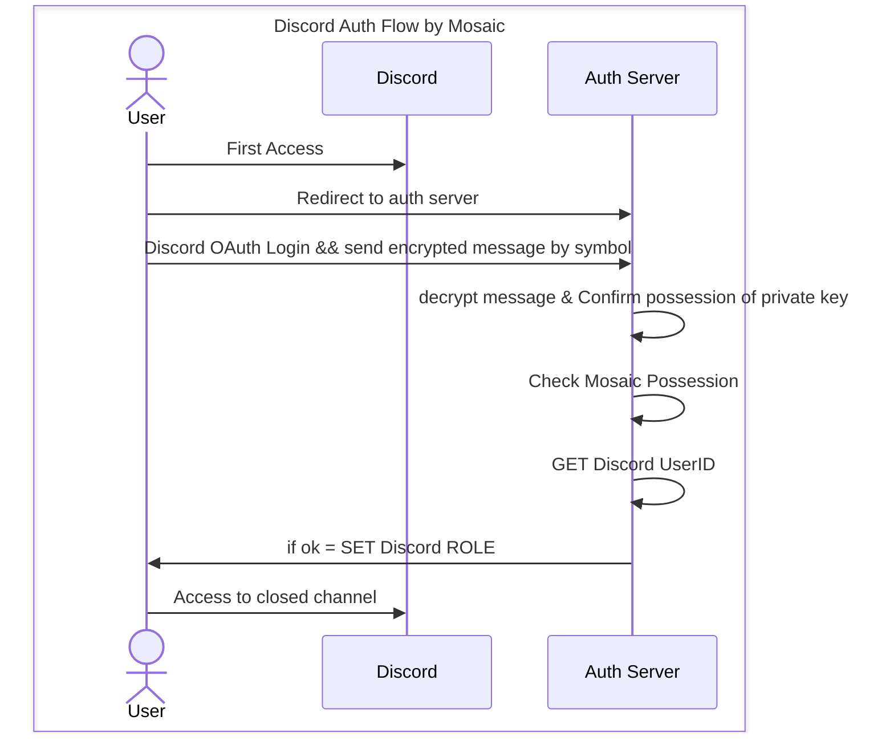

# discord mosaic authz

## 機能

Discord で OAuth2 認証を確認後、かつ SSS Extention での秘密鍵の所有を証明した上で、
特定 Mosaic の所有があれば指定されたロールを付与する discord application.

前提として、Mosaic を手放した際のロール剥奪機能は未実装。別途 Cron を実行し、定期的に Mosaic の所有を監視する必要を要する。

## 認証フロー

1. ユーザーが discord サーバーに参加する
2. 認証用 URL を踏んで認証サーバーにアクセスする
3. 認証サーバーで discord oauth ログイン
4. 次に Blockchain Wallet で暗号化メッセージを作成し、認証サーバーのバックエンドへ送信
5. バックエンドで暗号化メッセージを複合し、秘密鍵の所有を証明
6. ユーザーの公開鍵情報より特定 TOKEN の所有状況を検証
7. 特定 TOKEN の所有が確認された場合、 discord のログイン情報を元に、 discord bot より ROLE を付与
8. 該当 ROLE を保有するユーザーのみアクセス可能なチャンネルへアクセス開始

## flow

1. user joins the discord server
2. access to the authentication server by following the URL for authentication 3. discord oauth login on the authentication server
3. discord oauth login on the authentication server 4. then create an encrypted message with Blockchain Wallet and send it to the backend of the authentication server
4. then create an encrypted message in Blockchain Wallet and send it to the backend of the authentication server 5.
5. composite the encrypted message on the backend to prove possession of the private key
6. Verify ownership of the specific TOKEN using the user's public key information
7. If possession of the specified TOKEN is confirmed, discord bot grants ROLE based on discord login information
8. start access to the channel that only the user who owns the ROLE can access

## discord permissions

[console](https://discord.com/developers/applications)

### Bot install

- OAUTH Scope
  - bot
- Bot Permissions
  - Manage Role

### User OAuth

- OAUTH Scope
  - identify
