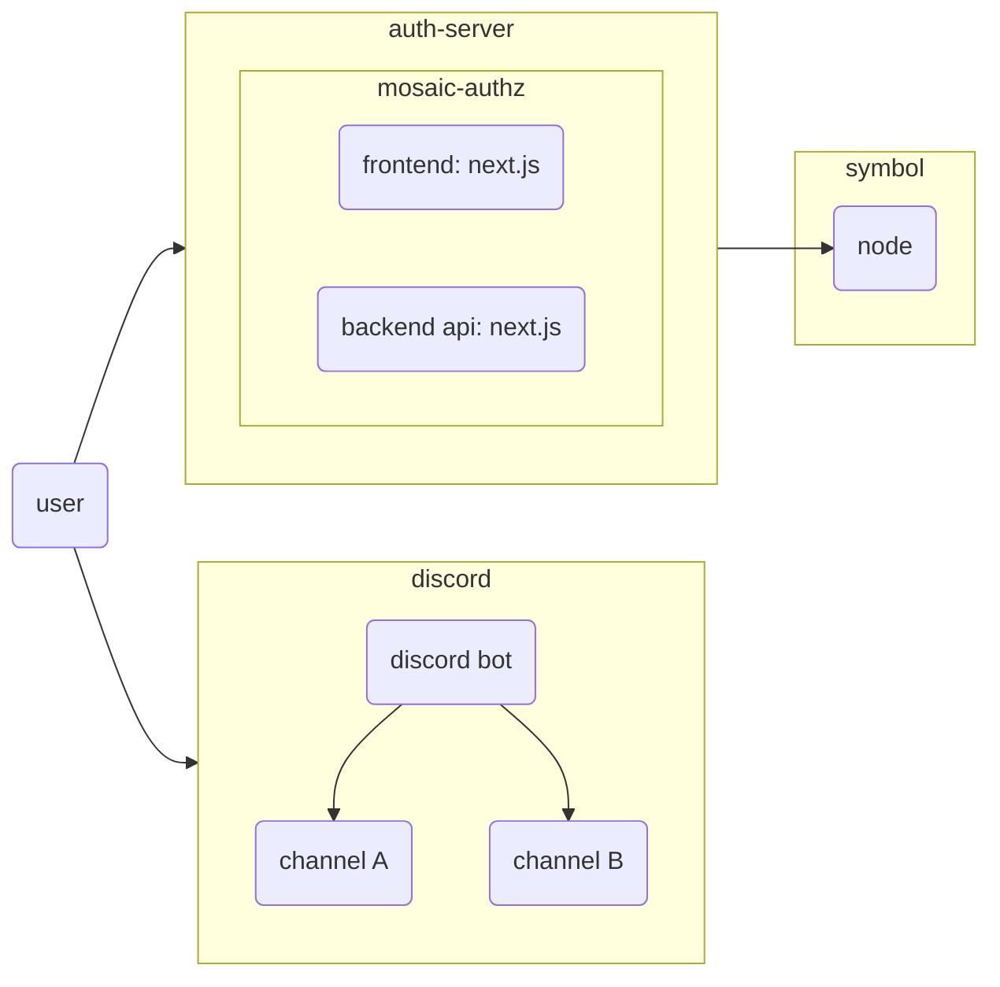
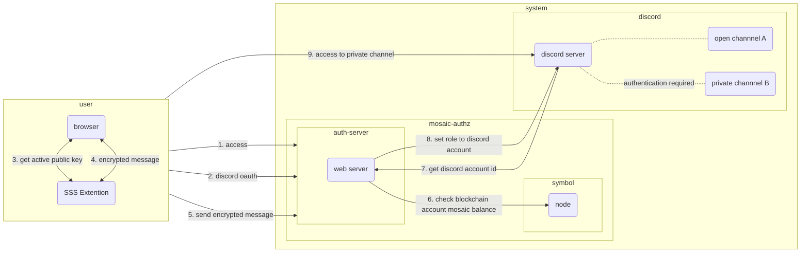
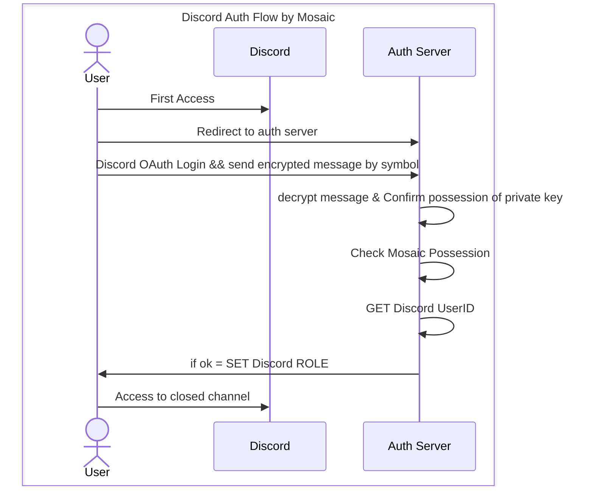

# mosaic authz

## Introduction

This is an authentication solution that leverages the Blockchain Symbol's Mosaic, allowing each channel of the discord to be built as a channel that can only be accessed by users with membership cards.
This authentication solution allows you to manage your discord community in a secure and efficient way. It is possible to restrict who can access a channel, as users without the specified Mosaic, a membership card, cannot attempt to gain unauthorized access.

## Infrastructure

The mosaic authz must be set up as a web server separate from the discord. symbol node can be connected to an already public node, or you can set up a new dedicated node by yourself.

* [symbol node list](https://symbol-tools.com/symbolTools/view/tool/nodeList.html)
* [how to build symbol node](https://symbol-community.com/docs/6)

## Auth Flow

This solution is started separately from discord, and after discord oauth authentication, it verifies whether or not the specified mosaic is owned. The flow of authentication is shown below.

1. user joins the discord server
2. access to the authentication server by following the URL for authentication 3. discord oauth login on the authentication server
3. discord oauth login on the authentication server 4. then create an encrypted message with Blockchain Wallet and send it to the backend of the authentication server
4. then create an encrypted message in Blockchain Wallet and send it to the backend of the authentication server 5.
5. composite the encrypted message on the backend to prove possession of the private key
6. Verify ownership of the specific TOKEN using the user's public key information
7. If possession of the specified TOKEN is confirmed, discord bot grants ROLE based on discord login information
8. start access to the channel that only the user who owns the ROLE can access

## Quick Start

Below are the steps to use mosaic authz. There are two options for launching the application: build it yourself or use a docker container.

1. [Create a discord BOT](./docs/en/01-create-a-discord-bot.md)
2. [Deploy mosaic authz](./docs/en/02-mosaic-authz-deploy-build.md)

## Links

- [mosaic-authz-ja](./docs/ja/)
- [Symbol Community Web](https://symbol-community.com/)
