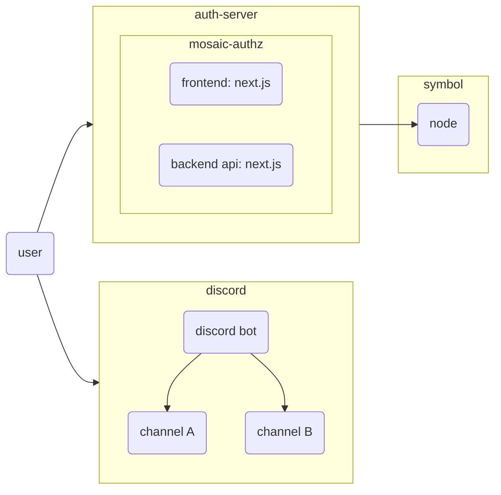
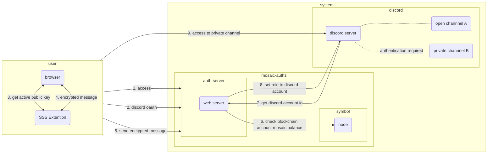
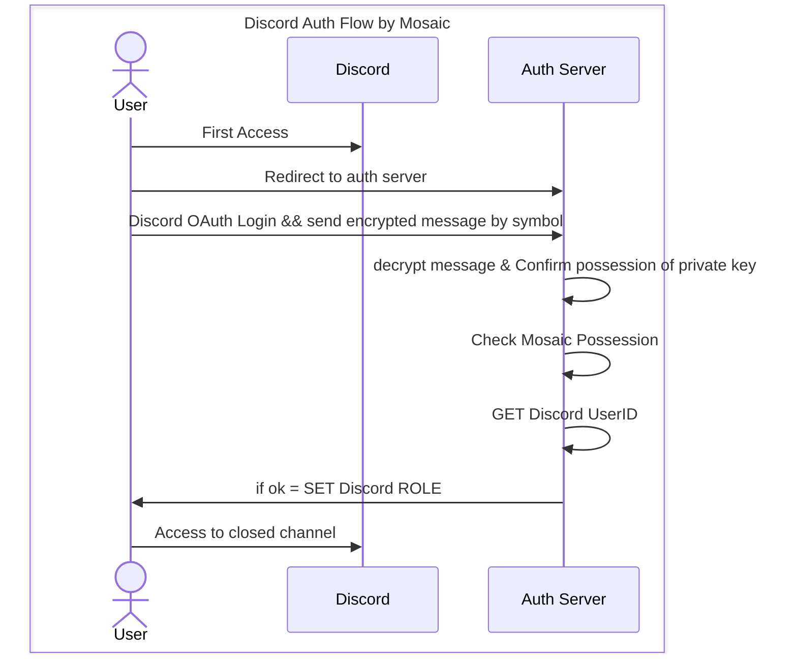

# mosaic authz

## Introduction

これは、Blockchain Symbol の Mosaic を活用した認証ソリューションです。discord のチャンネルごとに、会員証を持つユーザーのみがアクセス可能なチャンネルを構築することができます。
この認証ソリューションは、安全かつ効率的な方法で discord のコミュニティを管理することができます。会員証である 指定された Mosaic を持たないユーザーが不正アクセスを試みることができないため、チャンネルにアクセスするユーザーを制限する事ができます。

## Infrastructure

mosaic authz は discord とは別に web server として立ち上げる必要があります。symbol node は既に公開されているノードへ接続するか、自身で新たに専用のノードを用意して下さい。

[symbol node list](https://symbol-tools.com/symbolTools/view/tool/nodeList.html)
[how to build symbol node](https://symbol-community.com/docs/6)

## Auth Flow

本ソリューションは discord とは別に起動し discord oauth 認証の後、指定 mosaic の所有有無を検証します。以下の通り認証時のフローを示します。

1. ユーザーが discord サーバーに参加する
2. 認証用 URL を踏んで認証サーバーにアクセスする
3. 認証サーバーで discord oauth ログイン
4. 次に Blockchain Wallet で暗号化メッセージを作成し、認証サーバーのバックエンドへ送信
5. バックエンドで暗号化メッセージを複合し、秘密鍵の所有を証明
6. ユーザーの公開鍵情報より特定 TOKEN の所有状況を検証
7. 特定 TOKEN の所有が確認された場合、 discord のログイン情報を元に、 discord bot より ROLE を付与
8. 該当 ROLE を保有するユーザーのみアクセス可能なチャンネルへアクセス開始

## Quick Start

以下に mosaic authz を利用する為の手順を示します。アプリケーションの起動オプションは自身でビルドする方法と docker container を用いる方法の 2 つを提供します。

1. [Create a discord BOT](./01-create-a-discord-bot.md)
2. [Deploy mosaic authz](./02-mosaic-authz-deploy-build.md)
